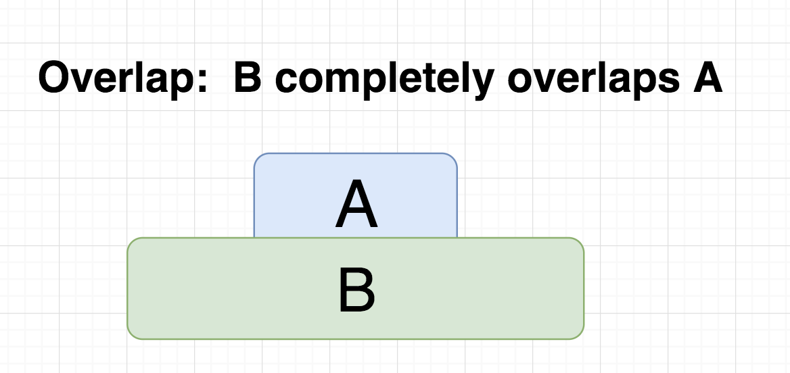

<!-- $theme: gaia -->

# Algorithm Patterns: Part 1

---

#### Who hates leetcode?

---

#### Algorithm Pattern:  a method, strategy, or technique of solving a problem.

---

# we are conditioned to look for complicated solutions

---

## Patterns
* two pointers
* sliding window
* fast and slow pointers
* merge intervals
* in place linked list traversal
* cyclic sort
* tree breadth first search
* tree depth first searh
* two heaps

---

## Patterns continued
* subsets
* modified binary search
* top elements
* knapsack
* k way marge
* topological sort
* a few others...

---

## What we'll cover (hopefully!)
* two pointers
* sliding window
* fast and slow pointers
* merge intervals
---

## Personal story

---

## Pattern 1: Two Pointers

### One Liner

An efficient technique for searching pairs in sorted arrays.

---
## Pattern 1: Two Pointers

### General Idea

Use two pointers, representing the first and last element and add the values together. If the result matches the predicate then you done. If the sum is to high, decrement the end pointer, if the sum is to low, increment the start pointer.

---
## Pattern 1: Two Pointers

### Identifying

Sorted array

Calculate something of a given size

---

## Pattern 2: Sliding Window
---

## Pattern 2: Sliding Window

### One Liner

TODO

---

## Pattern 2: Sliding Window

### General Idea
TODO

---

### What is a window?
A contiguouss subsequence of a sequental structure.

There are different kinds of sliding windows, we're going to look fixed window.

---

#### What is a window

---

##### Key Insight

---

## Pattern 2: Sliding Window

### Identifying

You have an ordered container (array, string, et cetera)

You need to find some specific type of sub sequence that satisfies some condition

A O(n^2) is available

A nested loop can be re-written as a single loop in some problems

----

## Pattern 3: Fast and Slow Pointers

----

## Pattern 3: Fast and Slow Pointers

### One Liner

Use two pointers which move through some sequential  data structure at different speeds.

 
----

## Pattern 3: Fast and Slow Pointers

### General Idea

Use two pointers which move through some sequential  data structure at different speeds.

[not much else to say]

----

## Pattern 3: Fast and Slow Pointers
### Identifying

Handling cycles in a linked list or arrays

---
#### A cycle in a linked list

---

## Pattern 4: Merge Intervals

### One Liner

---

## Pattern 4: Merge Intervals

### General Idea

---

## Pattern 4: Merge Intervals
### Identifying

Overlapping intervals

----

## Six Cases

----	

---

---

---

---

---

---

## Find The Pattern