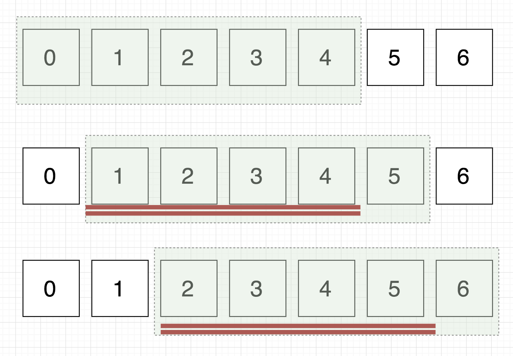
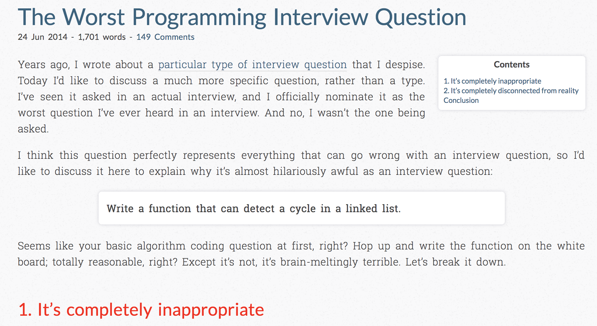
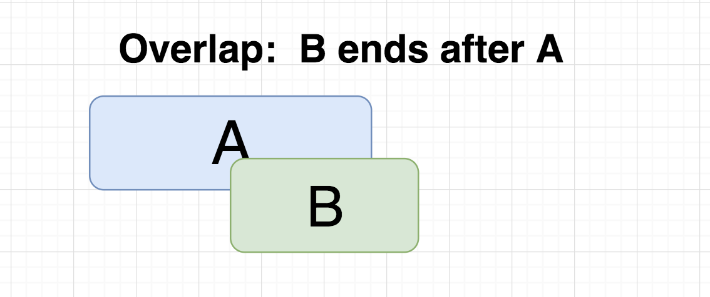
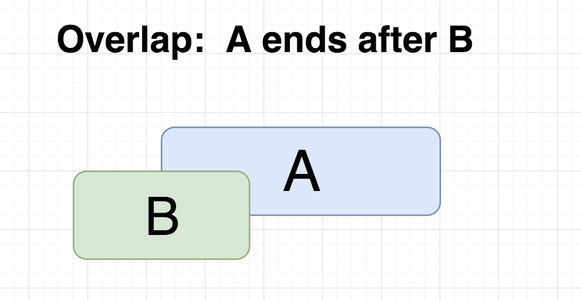

<!-- $theme: gaia -->


# Algorithm Patterns: Part 1

---


#### Who hates leetcode?


---


---

#### Algorithm Pattern:  a method, strategy, or technique of solving a problem.

---

# we are conditioned to look for complicated solutions

---

## Patterns
* two pointers
* sliding window
* fast and slow pointers
* merge intervals
* in place linked list traversal
* cyclic sort
* tree breadth first search
* tree depth first searh
* two heaps

---

## Patterns continued
* subsets	
* dynamic programming 
* modified binary search
* top elements
* knapsack
* k way marge
* topological sort
* a few others...

---

# We'll cover some of these today

---

## Pattern 1: Two Pointers


---

## Pattern 1: Two Pointers

### One Liner

An efficient technique for searching pairs in sorted arrays.

---
## Pattern 1: Two Pointers


### General Idea

* Use two pointers, representing the first and last element and add* the values together. 

* If the result matches the predicate then you're done.

* If the sum is too high, decrement the end pointer, if the sum is too low, increment the start pointer.


(* some monoid)

---
## Pattern 1: Two Pointers


### Identifying

Sorted array
		
Calculate something of a given size


---


## Two Pointers: Problem 1

Given a sorted array of ints, return two indexes where the of the sum values is equal to `n`.


```
input:
arr = [1, 2, 3, 4, 5, 6, 7, 8, 9, 10]
n = 7

output:
[0,5]
```

---


## Two Pointers: Problem 2

Given a sorted array of ints, return ***all*** pairs of indexes which sum to `n`.


```
input:
arr = [1, 2, 3, 4, 5, 6, 7, 8, 9, 10]
n = 7

output:
[[0, 5], [1, 4], [2, 3]]
```

---


## Two Pointers: Problem 3

Given an array of ints, find ***3*** indexes where the sum sum equals `k`

ex
```
input: 
arr = [-3, -2, -1, 0, 1, 2, 3]
k = 0

output:
[[-1,3,-2], [0,2,-2]]
```

---


## Pattern 2: Sliding Window

---

## Pattern 2: Sliding Window

### One Liner

Dynamicaly expand the end and contract the start of a subsequence during iteration, 
while never evaluating the same index twice. 

---

### What is a window?
A contiguous subsequence of a linear structure.

---

## Sliding Window: General Idea

* start with two pointers (index variables) to the start of an array or list (window start" and "window end")
* increment `end`  until some condition met.
* Process values as you go.

When condition met
* add result to result set
* remove the `start`'s value
* increment `start`


---

## Pattern 2: Sliding Window

### Identifying

You have an ordered container (array, string, et cetera)

You need to find some specific type of sub sequence that satisfies some condition

A O(n<sup>2</sup>) is available

A nested loop can be re-written as a single loop in some problems

---


## Sliding window: Problem 1:

Given a sorted array of ints
return an array of sums  of every k<sup>th</sup> subsequence.


*What does brute force look like?*


```
Input: 
arr = [1,2,3,4,5,6,7,8,9,10]
k = 5

Output:
[15, 20, 25, 30, 35, 40]
```
*how do we optimize?*

---

#### What is a window


---


##### Key Insight


---

## Slide window: Problem 2

Given a string, find the longest substring with no more then K distinct characters.


```
Input:
str = "aarrbcdeefffe"
K = 2 

Output:
"eefffeee"
```

---


---

## Slide window: Problem 3

Given a string, find the longest substring with only unique characters.

```
Input:
str = "lakdjflasdjf"

Output:
"kdjflas"
```

---


	
---


## Pattern 3: Fast and Slow Pointers


----

## Pattern 3: Fast and Slow Pointers

### One Liner

Use two pointers which move through some sequential  data structure at different speeds.

 
----

## Pattern 3: Fast and Slow Pointers

### General Idea

Use two pointers which move through some sequential  data structure at different speeds.

[not much else to say]


---

## Pattern 3: Fast and Slow Pointers
### Identifying

Handling cycles in a linked list or array

---
#### A cycle in a linked list


image:	 hackkerrank.com


---




<sup style="font-size: 12px;"> source: https://www.nomachetejuggling.com/2014/06/24/the-worst-programming-interview-question/ </sup>


---

## Fast & Slow: Problem 1

Given a linked list, determine if a cyle exsts.

ex
```
input:
head = node;

output: 
true
```

---


## Fast & Slow: Problem 2

Given a linked list, if a cycle exists, return its length.


```
Input:
head = node;

Output: 
5
```

---

## Fast & Slow	: Problem 3

Find the middle node of a ***singly*** linked list

```
input:
root_node or  linked_list

output:
middle_node
```

---

# meta pattern

---

## Pattern 4: Merge Intervals

### One Liner

Efficiently solve problems that contain overlapping intervals


---

## Pattern 4: Merge Intervals

### General Idea (double check)

1. Sort the Intervals based on the increasing order of start time

2. Push the first interval on to a result set

3. If the current interval does not overlap with the stack top, push it
If the current element overlaps with stack top and ending time of current interval is more     than that of stack top, update stack top with the ending time of current interval
---

## Pattern 4: Merge Intervals
### Identifying

Anything with intervals

in most cases, we are either finding or merging interval


----

## Six Cases

----	


---



---


---



---


---


---

## Merge Intervals: Problem 1

Given an array of intervals, merge overlapping intervals


```
Input: 
[[1,4], [7,9],[2,5]]

Output: 
[[1,5], [7,9]]
```

---

## Merge Intervals: Problem 2
Given an array of intervals, select the most intervals such that none overlap.


```
Input: 
[[1,6], [1,4], [2,5], [5,7],[8,9]]
Output: 
[[1,4], [5,7], [8,9]]
```

--- 

## Merge Intervals: Problem 3
A conference room is available to be booked between 900 and 1800
fxind the largest available space of time given an array of bookings.


ex
```
input:
[[900, 1000],[1100,1200],[1500,1800]]

output: 
[1300,1500]
```


---

## Pattern 5: Subsets

---

## Subsets

### One Liner

Many problems involve permutations/combinations of a given set, breadth fist search is an efficient solution to these problems.

---

## Subsests
### General idea

---


##  Subsests
### Identifying

---

## Subsets: Problem 1

todo

ex
```

```

---

## Subsets: Problem 2

--- 

## Subsets: Problem 3


---


## Pattern 6: Cyclic Sort

---

## Cyclic Sort

### One Liner


---

## Cyclic Sort
### General idea

---


##  Cyclic Sort
### Identifying

---

## Cyclic Sort: Problem 1

todo

ex
```

```

---

## Cyclic Sort: Problem 2

--- 

## Cyclic Sort: Problem 3


---
## Pattern 7: In-place Reversal of a Linked List

---

## In-place Reversal of a Linked List

### One Liner


---

## In-place Reversal of a Linked List
### General idea

---


##  In-place Reversal of a Linked List
### Identifying

---

## Problem 1:  In-place Reversal of a Linked List

reverse a linked list in place

---

## Problem 2:  In-place Reversal of a Linked List

reverse a linked list in place

---

## Problem 3:  In-place Reversal of a Linked List

reverse a linked list in place


---


## Misc. Patterns

---

##  Misc: Reservoire Sampling

---


## Misc: Outer/Inner Nodes

---
## Outer/Inner Nodes: Problem 1


Given a linked list where each node has a `next` pointer and a `random` pointer, make a copy of the linked list

---
